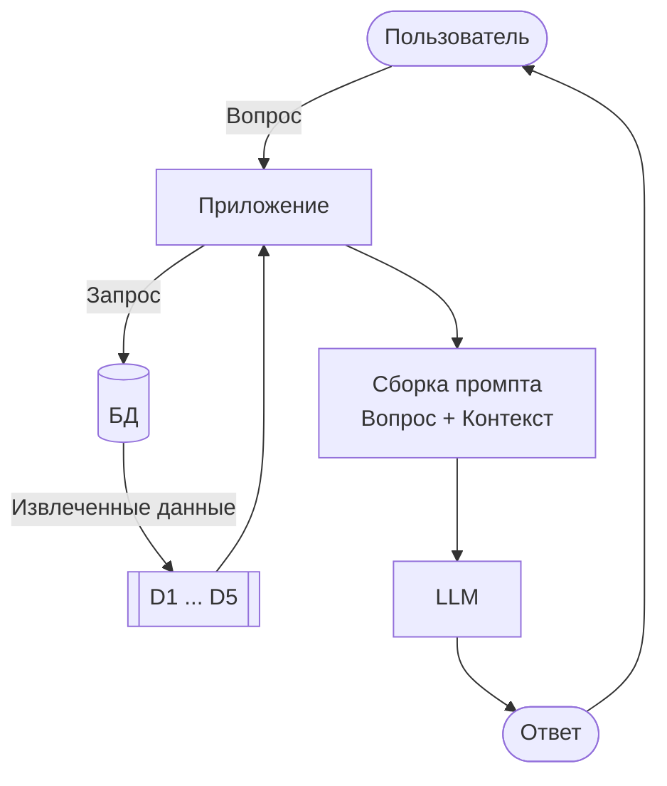

# RAG

Видео: [Смотреть этот урок](https://www.youtube.com/watch?v=JktYwBIDErk&list=PL3MmuxUbc_hLZFNgSad56pDBKK8KO0XIv)

В DataTalks.Club мы проводим бесплатные курсы Zoomcamp по инженерии данных, машинному обучению, MLOps и другим темам. Для каждого курса есть свой документ FAQ с часто задаваемыми вопросами и ответами.

Некоторые из этих документов содержат более 300 вопросов. Студенты спрашивают нас в Slack о таких вещах, как «Могу ли я еще присоединиться после начала курса?» или «Как мне получить сертификат?». Искать ответы в FAQ вручную утомительно.

Мы хотим создать бота, который возьмет все эти знания и будет отвечать на вопросы студентов на естественном языке.

В этом модуле мы построим такую систему. Но сначала давайте посмотрим, почему мы не можем просто отправить вопрос напрямую в LLM и на этом закончить.

## Обычным LLM не хватает наших данных

Сначала определим функцию для общения с LLM:

```python
def llm(prompt):
    response = openai_client.responses.create(
        model="gpt-5.4-mini",
        input=prompt
    )
    return response.output_text
```

Это наш «черный ящик» — текст входит, текст выходит.

Давайте протестируем его:

```python
llm("Hey, what's up?")
```

Он что-то отвечает. LLM работает.

Зададим ему вопрос, специфичный для курса:

```python
question = "I just discovered the course. Can I join now?"
answer = llm(question)
print(answer)
```

LLM дает общий ответ. Она может сказать «обычно вы можете присоединиться» или «проверьте сайт курса». Она ничего не знает о наших конкретных курсах Zoomcamp, их политике регистрации или расписании. Она пытается быть полезной, но понятия не имеет о реальном статусе регистрации или правилах.

Это отличается от вопроса типа «как приготовить лосося?» — LLM знает ответ, потому что приготовление лосося является общеизвестным фактом. Но наших курсов нет в обучающих данных.

## Добавление контекста вручную

Больше контекста может это исправить. На сайте FAQ есть вопросы и ответы о наших курсах.

Скопируем часть этого контента в промпт:

```python
context = """
I just discovered the course. Can I still join?
Yes, but if you want to receive a certificate, you need to submit your project while we're still accepting submissions.

Course: I have registered for the LLM Zoomcamp. When can I expect to receive the confirmation email?
You don't need it. You're accepted. You can also just start learning and submitting homework (while the form is open) without registering. It is not checked against any registered list. Registration is just to gauge interest before the start date.

What is the video/zoom link to the stream for the "Office Hours" or live/workshop sessions?
The zoom link is only published to instructors/presenters/TAs. Students participate via YouTube Live and submit questions to Slido.

Cloud alternatives with GPU
Check the quota and reset cycle carefully. Potential options include Google Colab, Kaggle, Databricks.
"""
```

Обратите внимание, что промпт не заканчивается на `Answer:`. В старых моделях, таких как GPT-3, мы добавляли это, чтобы подтолкнуть модель к завершению предложения. Современным моделям эта подсказка не нужна, поэтому мы ее опускаем.

Сформируем промпт, который включает и вопрос, и контекст:

```python
prompt = f"""
Your task is to answer questions from the course participants
based on the provided context.

Use the context to find relevant information and provide accurate
answers. If the answer is not found in the context,
respond with "I don't know."

Question:
{question}

Context:
{context}
"""
```

Вместо того чтобы отправлять чистый вопрос в LLM, мы отправляем этот промпт:

```python
answer = llm(prompt)
print(answer)
```

После этого ответ становится правильным: «Да, вы все еще можете присоединиться. Если вы хотите получить сертификат, вам нужно сдать проект, пока прием работ еще открыт».

Это именно тот ответ, который мы хотим дать нашим студентам. То, что мы только что сделали, и есть RAG.

## Извлечение плюс генерация (Retrieval plus generation)

RAG расшифровывается как Retrieval-Augmented Generation (генерация, дополненная извлечением). Генерация — это создание текста моделью LLM, а извлечение — это поиск. Мы извлекаем соответствующие документы из нашей базы знаний и используем их для дополнения того, что генерирует LLM. Именно этот шаг поиска дает LLM контекст, необходимый для правильного ответа.

То, что мы только что сделали, было наивным подходом. Я заранее знал, в какой записи FAQ содержится ответ, и вставил ее вручную. Вместо этого мы хотим выполнять поиск автоматически. Мы берем вопрос студента, находим наиболее подходящие документы и отправляем их в LLM.

В коде это выглядит так:

```python
def rag(question):
    search_results = search(question)
    user_prompt = build_prompt(question, search_results)
    return llm(user_prompt)
```

Это вся архитектура. Она сводится к трем компонентам.

Эти части: поиск, промпт и LLM:

- Поиск (search)
- Промпт (prompt)
- LLM



LLM видит только те документы, которые мы ей передаем, поэтому ее ответы основаны на наших данных. Если извлечен правильный документ, ответ будет хорошим. Если нет, LLM получит неверный контекст, и ответ будет неправильным. Ваша модель хороша лишь настолько, насколько хорошо ваше извлечение (retrieval), поэтому качество поиска имеет огромное значение для RAG.

База данных и LLM могут быть любыми. В этом курсе мы используем `minsearch`, а затем `sqlitesearch` для поиска и OpenAI для LLM. Но вы можете заменить любой компонент на другой и посмотреть, что работает лучше.

Поскольку каждая часть независима, RAG остается гибким. Чтобы использовать Anthropic вместо OpenAI, вы меняете вызов LLM. Чтобы использовать Elasticsearch вместо `minsearch`, вы меняете вызов поиска. Все остальное остается прежним.

В следующем разделе мы рассмотрим набор данных, который будем использовать для нашей базы знаний FAQ.

[← Окружение](02-environment.md) | [Набор данных FAQ курса →](04-dataset.md)
