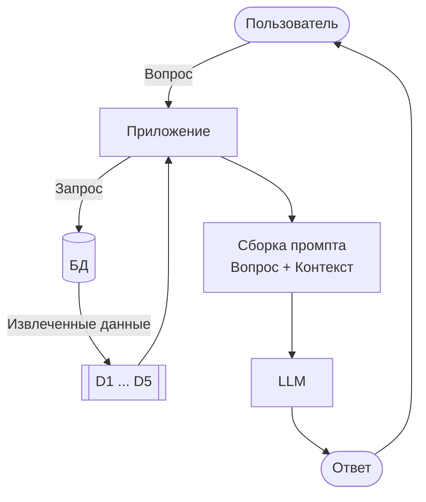

# LLM (Большая языковая модель)

Видео: [Смотреть этот урок](https://www.youtube.com/watch?v=KHePGkeFn54&list=PL3MmuxUbc_hLZFNgSad56pDBKK8KO0XIv)

Последний компонент нашего конвейера RAG — это LLM. Она принимает промпт, который мы собрали, и генерирует ответ.

## Отправка промпта в LLM

У нас есть промпт из предыдущего раздела.

Отправим его в LLM:

```python
response = openai_client.responses.create(
    model="gpt-5.4-mini",
    input=prompt
)
```

Мы используем Responses API от OpenAI (`openai_client.responses.create`). У OpenAI есть два API: Chat Completions и Responses. Chat Completions — более старый и теперь считается устаревшим (legacy). Когда начиналось первое издание этого курса, Responses API еще не существовало, поэтому мы использовали Chat Completions. Теперь мы предпочитаем Responses, так как это удобнее.

Есть нюанс, о котором стоит знать. Многие другие провайдеры, такие как Groq и Gemini, предоставляют клиент, совместимый с OpenAI. Но они поддерживают Chat Completions, а не Responses. Поэтому, если вы смените провайдера, вы оставите клиент OpenAI, но будете вызывать `chat.completions` вместо `responses`.

## Изучение ответа

Ответ представляет собой объект Pydantic. Сам ответ находится в `response.output` — списке выходных элементов.

Первый элемент — это сообщение:

```python
response.output[0]
```

У сообщения есть список `content`, а текст находится в первом элементе:

```python
response.output[0].content[0].text
```

Довольно длинный путь, чтобы добраться до одной строки.

Более короткий путь избавляет нас от этого:

```python
response.output_text
```

Тот же результат, меньше кода. Ответ должен быть примерно таким: «Да, вы все еще можете присоединиться. Если вы хотите получить сертификат, обязательно сдайте проект, пока прием работ еще открыт».

Счетчики использования (usage) показывают, сколько токенов потребил запрос:

```python
response.usage
```

Вы увидите что-то вроде:

```text
ResponseUsage(input_tokens=334, output_tokens=39, total_tokens=373)
```

## Расчет стоимости

Вы можете использовать разные модели.

В этом курсе мы будем использовать [gpt-5.4-mini](https://developers.openai.com/api/docs/models/gpt-5.4-mini):

- Входящие токены (Input): $0.75 за миллион токенов
- Исходящие токены (Output): $4.50 за миллион токенов

Давайте рассчитаем стоимость только что сделанного запроса:

```python
input_price = 0.75 / 1_000_000
output_price = 4.50 / 1_000_000

cost = (
    response.usage.input_tokens * input_price +
    response.usage.output_tokens * output_price
)

cost
```

Этот конкретный запрос стоит ничтожную долю цента. Даже полный запрос RAG с длинным промптом обходится дешевле $0.01. Нам нужно отправить очень много запросов, чтобы потратить хотя бы один цент. Эти модели очень дешевы для экспериментов.

Объект `usage` также сообщает о закешированных входящих токенах. Они тарифицируются по более низкой ставке, когда один и тот же префикс промпта повторяется.

## История сообщений

Ранее мы отправляли только одну строку в качестве входных данных и получали ответ. На практике обычно отправляется история сообщений — список сообщений, где у каждого сообщения есть своя роль.

Вспомните диалог в ChatGPT. Он начинается со скрытого системного промпта, который говорит LLM, как себя вести (вы его никогда не видите). После этого ваши сообщения и ответы LLM чередуются. У LLM нет собственной памяти, поэтому ей нужно передавать всю историю, чтобы она могла продолжить диалог.

Мы не будем строить здесь многоходовый чат. Но мы все равно используем этот формат сообщений, чтобы отделить наши инструкции от пользовательского промпта.

Мы отправляем два сообщения:

- `developer` — инструкции системного уровня (как должна вести себя LLM)
- `user` — фактический промпт с вопросом и контекстом

```python
message_history = [
    {"role": "developer", "content": INSTRUCTIONS},
    {"role": "user", "content": prompt}
]

response = openai_client.responses.create(
    model="gpt-5.4-mini",
    input=message_history
)
```

Это отделяет фиксированные инструкции от пользовательского промпта, который меняется при каждом запросе.

OpenAI принимает и `developer`, и `system` для роли инструкций. Между ними может быть какая-то разница, но на практике я не вижу, чтобы это как-то меняло результат. В этом курсе мы используем `developer`.

## Функция LLM

Теперь мы можем собрать все это в обновленную функцию `llm`.

Теперь она принимает и инструкции, и пользовательский промпт:

```python
def llm(instructions, user_prompt, model="gpt-5.4-mini"):
    message_history = [
        {"role": "developer", "content": instructions},
        {"role": "user", "content": user_prompt}
    ]

    response = openai_client.responses.create(
        model=model,
        input=message_history
    )

    return response.output_text
```

## Полный RAG

Когда поиск, промпт и LLM готовы, мы соединяем их вместе:

```python
def rag(query, model="gpt-5.4-mini"):
    search_results = search(query)
    prompt = build_prompt(query, search_results)
    answer = llm(INSTRUCTIONS, prompt, model=model)
    return answer
```

Обновленная архитектура:



Попробуйте:

```python
answer = rag("I just discovered the course. Can I join now?")
print(answer)
```

Ответ должен быть основан на документах FAQ, а не на общих знаниях LLM. LLM прочитала результаты поиска и сгенерировала ответ, основанный на наших данных.

## Попробуйте другие вопросы

Попробуйте еще несколько:

```python
rag("How do I get a certificate?")
```

Обратите внимание, как ответы ссылаются на конкретные курсы и разделы. LLM читает нашу базу знаний перед тем, как ответить — именно так работает RAG.

Этот подход модульный. Вы можете заменить поисковый движок, шаблон промпта или модель LLM. Ничего другого менять не нужно. Позже, когда мы заменим `minsearch` на `sqlitesearch`, изменится только функция `search`.

Код: [notebook.ipynb](../code/notebook.ipynb)

[← Сборка промпта](06-building-prompt.md) | [RAG Helper →](08-rag-helper.md)
