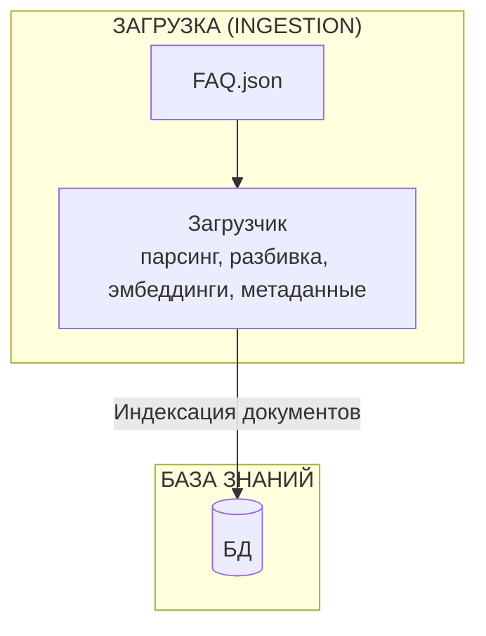
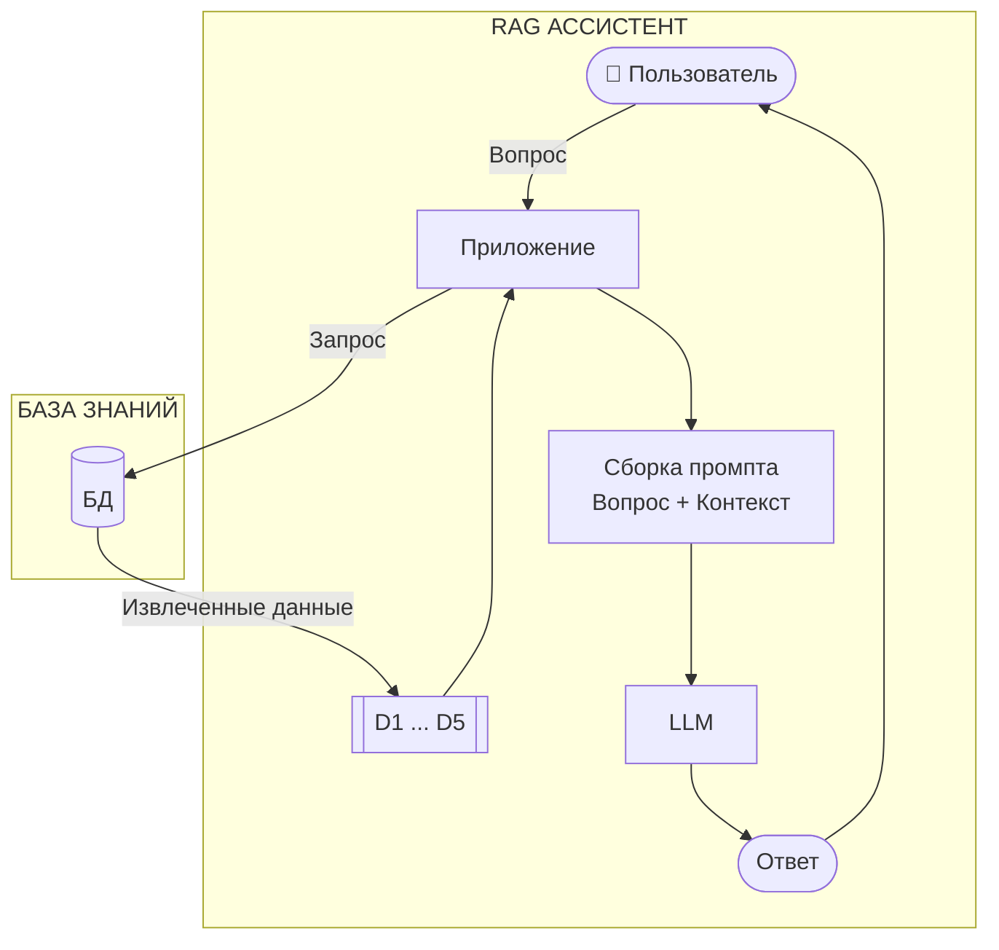

# Загрузка данных (Ingestion)

Видео: [Смотреть этот урок](https://www.youtube.com/watch?v=e0owGI2JV-s&list=PL3MmuxUbc_hLZFNgSad56pDBKK8KO0XIv)

До сих пор наш конвейер RAG загружал данные и строил поисковый индекс при запуске. С `minsearch` это нормально — наш набор данных FAQ небольшой, поэтому индексация занимает меньше секунды. Весь конвейер работает в одном процессе.

Этот подход перестает работать по мере роста набора данных. Загрузка данных требует времени — вызов API, парсинг файлов, очистка текста. При наличии миллионов документов запуск становится медленным. Вы не захотите ждать несколько минут каждый раз при перезапуске сервиса.

`Minsearch` работает в оперативной памяти. Это набор словарей Python, привязанных к процессу, в котором они запущены. Когда вы останавливаете процесс, данные исчезают, поэтому при каждом перезапуске приходится проводить переиндексацию. Это расточительно, если индексация идет медленно или подготовка данных занимает много времени.

Поэтому мы разделяем процесс загрузки данных (ingestion) и процесс выполнения запросов (querying). Один процесс записывает данные в постоянный поисковый индекс. Другой процесс читает из него. Эти два процесса работают независимо и только совместно используют индекс.

Индекс сохраняется после перезапуска, поэтому мы загружаем данные один раз, а запрашиваем их столько, сколько захотим. Это этап загрузки (ingestion) из области инженерии данных. Мы перемещаем данные из источника в целевую систему, которую может использовать приложение.

Для этого можно использовать любой постоянный поисковый бэкенд, такой как Elasticsearch, OpenSearch или Qdrant. В этом модуле мы используем [sqlitesearch](https://github.com/alexeygrigorev/sqlitesearch) — легкую поисковую библиотеку на основе SQLite FTS5. Она имеет тот же API, что и `minsearch`, поэтому является прямой заменой, которая к тому же обеспечивает постоянство хранения.

Я выбрал SQLite, потому что она ничего от вас не требует. Она поставляется вместе с Python, поэтому вам не нужно добавлять лишние зависимости, и в нее встроен FTS5 (полнотекстовый поиск). Если у вас есть Python, у вас уже есть движок полнотекстового поиска. Прямое использование FTS5 немного неудобно, поэтому я написал `sqlitesearch` как удобную обертку над ним.

Подробнее об истории создания этой библиотеки можно прочитать [здесь](https://alexeyondata.substack.com/p/how-i-built-sqlitesearch-a-lightweight).

Установите ее:

```bash
uv add sqlitesearch
```

## Ноутбук для загрузки данных

Создайте новый ноутбук с названием `sqlite-ingest.ipynb` (см. [persistent_rag_ingest.ipynb](../code/persistent_rag_ingest.ipynb) для примера). Это процесс загрузки — он получает данные и записывает их в постоянный индекс.

Сначала загрузите данные, используя функцию из `ingest.py`:

```python
from ingest import load_faq_data

documents = load_faq_data()
print(f"Loaded {len(documents)} documents")
```

Отфильтруйте только документы для курса LLM Zoomcamp:

```python
docs_llm = [doc for doc in documents if doc["course"] == "llm-zoomcamp"]
print(f"LLM Zoomcamp: {len(docs_llm)} documents")
```

Теперь создайте индекс `sqlitesearch` и добавьте документы по одному с небольшой задержкой (чтобы имитировать медленную загрузку):

```python
import time
from sqlitesearch import TextSearchIndex

index = TextSearchIndex(
    text_fields=["question", "section", "answer"],
    keyword_fields=["course"],
    db_path="faq.db"
)

for doc in docs_llm:
    index.add(doc)
    print(f"""Added: {doc["question"][:60]}...""")
    time.sleep(0.5)

index.close()
print("Done. Index saved to faq.db")
```

Запустите этот ноутбук. Вы увидите, как каждый документ добавляется по одному. Когда процесс завершится, на диске появится файл `faq.db` со всем индексом. Этот файл сохраняется при перезапусках.

## Ноутбук для выполнения запросов

Пока идет загрузка (или после ее завершения), создайте другой ноутбук (см. [persinsent_rag.ipynb](../code/persinsent_rag.ipynb) для примера).

Подключитесь к той же базе данных:

```python
from sqlitesearch import TextSearchIndex

sqlite_index = TextSearchIndex(
    text_fields=["question", "section", "answer"],
    keyword_fields=["course"],
    db_path="faq.db"
)
```

Проверьте, сколько документов в индексе:

```python
sqlite_index.count()
```

Запустите эту ячейку несколько раз, пока в другом ноутбуке еще идет загрузка. Вы увидите, как число растет по мере продвижения загрузки. Это нормальное поведение базы данных: один процесс пишет, другой читает, оба одновременно. С `minsearch` это невозможно, так как индекс живет в памяти одного процесса, и никто другой не может до него добраться.

Попробуйте выполнить поиск:

```python
results = sqlite_index.search("Can I still join the course after it started?", num_results=5)
[doc["question"] for doc in results]
```

## RAG с sqlitesearch

Мы используем класс `RAGBase` из `rag_helper.py` с этим индексом `sqlitesearch`.

Поскольку наш RAG модульный, мы просто заменяем поисковый индекс — остальная часть кода остается прежней:

```python
from rag_helper import RAGBase
from openai import OpenAI

openai_client = OpenAI()

assistant = RAGBase(
    index=sqlite_index,
    llm_client=openai_client,
)
```

Этот код пропускает и вызов `fit`, и загрузку данных. Индекс уже заполнен в ноутбуке для загрузки, поэтому мы просто подключаемся к файлу базы данных.

Попробуйте:

```python
answer = assistant.rag("Can I still join the course after it started?")
print(answer)
```

Ответ должен быть похож на тот, что мы получили с `minsearch`. Но теперь данные поступают из постоянного индекса — никакой загрузки, обработки и индексации при запуске. И нам не пришлось переписывать логику RAG — только заменили индекс.

Модульная конструкция четко разделяет работу:

- `ingest.py` отвечает за загрузку данных и индексацию
- `rag_helper.py` отвечает за конвейер RAG
- ноутбуки соединяют их вместе

Это работает, потому что `sqlitesearch` следует тому же API, что и `minsearch` — у обоих есть метод `search`, который принимает запрос, `boost_dict`, `filter_dict` и `num_results`. Если бы API был другим, нам пришлось бы создать подкласс `RAGBase` и переопределить метод `search`, чтобы адаптироваться к новому бэкенду.

## Сравнение двух подходов

С minsearch (один процесс):

```text
Запуск: загрузка данных -> парсинг -> индексация -> готовность
При каждом перезапуске: повторение всех шагов
```

С sqlitesearch (два процесса):

```text
Загрузка (выполняется один раз): загрузка данных -> парсинг -> запись в faq.db
Запрос (выполняется каждый раз): открытие faq.db -> поиск -> готовность
```

Полная архитектура:



Процесс загрузки записывает документы в базу знаний.

Затем ассистент RAG читает из нее:



Для нашего набора данных FAQ оба подхода дают хорошие результаты. Разница становится более значимой при масштабировании и при работе с документами разной длины.

## Выбор подхода

Выберите правильный инструмент для ваших данных:

- `minsearch`: один процесс, только в оперативной памяти, переиндексация при каждом запуске. Используйте, когда данных немного и индексация проходит быстро.
- `sqlitesearch`: раздельные процессы загрузки и запроса, на основе файлов (SQLite), открывает существующий индекс. Используйте, когда данных много или загрузка идет медленно.

Используйте `minsearch`, когда вы можете загрузить и проиндексировать данные при запуске без заметной задержки. Переходите на постоянный бэкенд, когда загрузка занимает слишком много времени или когда вам нужно, чтобы индекс сохранялся после перезапусков.

Для крупных промышленных систем используйте ту же схему с другим бэкендом:

- Elasticsearch
- OpenSearch
- Qdrant (векторная база данных)
- Weaviate (векторная база данных)

Архитектура остается прежней: один процесс загружает, другой запрашивает.

## Завершение работы

Когда закончите, закройте соединение с базой данных:

```python
sqlite_index.close()
```

Или просто позвольте Python сделать это автоматически при выключении ядра ноутбука.

Код: [persistent_rag_ingest.ipynb](../code/persistent_rag_ingest.ipynb) | [persinsent_rag.ipynb](../code/persinsent_rag.ipynb)

[← RAG Helper](08-rag-helper.md) | [Завершение части 1 →](10-rag-next-steps.md)
