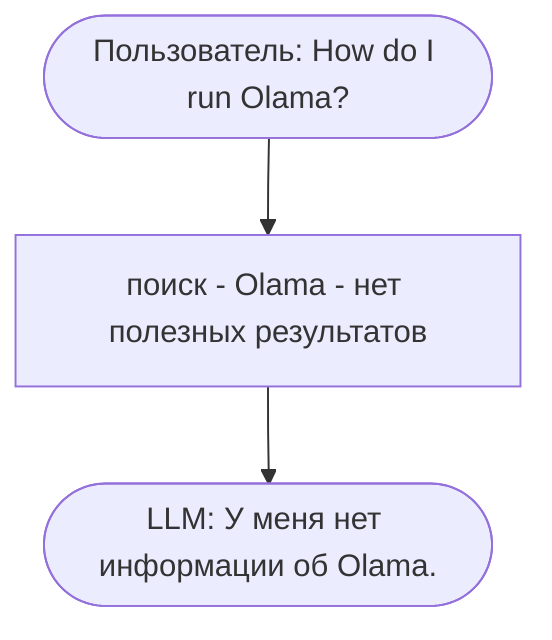
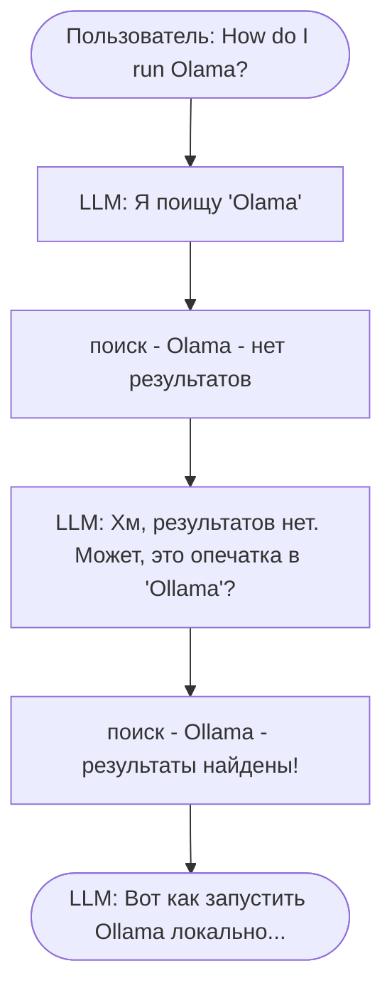

# Вызов функций (Function Calling)

Видео: [Смотреть этот урок](https://www.youtube.com/watch?v=CeEki_0mdGo&list=PL3MmuxUbc_hLZFNgSad56pDBKK8KO0XIv)

В предыдущем уроке мы построили конвейер RAG с использованием `RAGBase.rag()` и увидели, как он ломается из-за опечатки «Olama». Поиск не вернул ничего полезного, и у LLM не было способа это исправить.

Схема, которая дала сбой:



Алгоритм жестко задан: поиск, сборка промпта, LLM.

```python
def rag(self, query):
    search_results = self.search(query)
    prompt = self.build_prompt(query, search_results)
    answer = self.llm(prompt)
    return answer
```

LLM здесь выступает в роли пассажира, а не водителя. Она даже не видит плохих результатов поиска, поэтому не может попробовать снова с исправленным запросом.

## Альтернатива: агентный подход

Агент передает управление LLM.

Вместо того чтобы запускать поиск самим, мы даем LLM инструмент `search`. Она сама решает, когда его вызвать и что именно искать.

Тот же вопрос с опечаткой теперь обрабатывается так:



LLM выполнила поиск, увидела, что результаты плохие, и решила попробовать еще раз с другим запросом. Она приняла это решение самостоятельно. Мы не писали никакого кода для обработки опечаток.

Разница заключается в том, кто принимает решения:

- В обычном RAG решение принимает разработчик. Мы заранее фиксируем шаги, поэтому поиск всегда выполняется один раз с точным запросом пользователя.
- В случае с агентом решение принимает LLM. Она выбирает, какие действия предпринять и когда остановиться.

Механизм, который делает это возможным, называется «вызов функций» (function calling), и именно об этом пойдет речь в остальной части урока.

## Запрос без инструментов

Сначала посмотрим, что делает LLM без каких-либо инструментов. Зададим ей специфический вопрос по курсу и изучим ответ.

```python
messages = [
    {"role": "user", "content": "I just discovered the course. Can I join it?"}
]

response = openai_client.responses.create(
    model="gpt-5.4-mini",
    input=messages,
)

response.output_text
```

Модель отвечает на основе своих общих знаний, что-то вроде «это зависит от курса» или «проверьте сайт курса». Она ничего не знает о нашем FAQ, поэтому ответ получается расплывчатым и бесполезным. Именно поэтому нам нужен RAG и именно поэтому мы хотим дать модели инструмент.

## Определение инструмента

Сначала мы определим функцию `search` верхнего уровня, которая напрямую обращается к индексу `index`. Модель будет ссылаться на нее по этому имени. Мы сохраняем соответствие между именем функции в Python и именем инструмента, чтобы позже было проще выполнять вызов.

```python
def search(query):
    boost_dict = {"question": 3.0, "section": 0.5}
    filter_dict = {"course": "llm-zoomcamp"}

    return index.search(
        query,
        num_results=5,
        boost_dict=boost_dict,
        filter_dict=filter_dict
    )
```

Затем мы сообщаем модели об этой функции. Модель не видит наш код на Python, только схему (schema), описывающую, что делает функция и какие аргументы она принимает. LLM не зависят от языка программирования. В конечном итоге мы просто делаем HTTP-вызов, поэтому мы описываем инструмент в формате JSON, а не на Python. Та же схема будет работать в TypeScript или Java.

```python
search_tool = {
    "type": "function",
    "name": "search",
    "description": "Search the FAQ database for entries matching the given query.",
    "parameters": {
        "type": "object",
        "properties": {
            "query": {
                "type": "string",
                "description": "Search query text to look up in the course FAQ."
            }
        },
        "required": ["query"],
        "additionalProperties": False
    }
}
```

Поле `description` — самое важное, так как модель читает его, чтобы решить, когда вызывать функцию. `parameters` — это JSON-схема для аргументов, и мы помечаем `query` как обязательный (required), чтобы модель всегда его заполняла.

## Отправка вопроса с использованием инструмента

Теперь мы отправляем тот же вопрос, что и раньше, но на этот раз включаем инструмент в запрос:

```python
response = openai_client.responses.create(
    model="gpt-5.4-mini",
    input=messages,
    tools=[search_tool],
)

response.output
```

Посмотрите на вывод. Вместо сообщения с ответом результат содержит запись `function_call`. Модель решила, что ей нужно выполнить поиск в FAQ перед ответом. Вместо того чтобы ответить, она попросила нас сначала запустить функцию поиска.

Обратите внимание и на аргументы. Модель не передала наш вопрос дословно. Она рассудила, что исходный вопрос — не самый лучший поисковый запрос. Поэтому она переформулировала наш вопрос о регистрации в ключевые слова для поиска, такие как «enroll late join course».

## Выполнение функции и отправка результата обратно

Вызов функции содержит аргументы в формате JSON. Мы парсим их, вызываем нашу функцию `search` и сериализуем результат.

```python
import json

call = response.output[0]
args = json.loads(call.arguments)

results = search(**args)
result_json = json.dumps(results, indent=2)
```

Теперь мы отправляем этот результат обратно модели. Сначала мы добавляем ответ модели в историю диалога — модель должна видеть свой собственный вызов функции. Затем мы добавляем результат работы инструмента.

```python
messages.extend(response.output)

messages.append({
    "type": "function_call_output",
    "call_id": call.call_id,
    "output": result_json,
})
```

`call_id` связывает результат инструмента с конкретным вызовом функции, который запросила модель. Если модель делает несколько вызовов функций за один ход, каждый из них получает свой собственный `call_id`.

## Повторный запрос к модели

Мы вызываем API второй раз с расширенной историей:

```python
response = openai_client.responses.create(
    model="gpt-5.4-mini",
    input=messages,
    tools=[search_tool],
)

response.output_text
```

На этот раз у модели есть исходный вопрос, ее собственное решение вызвать `search` и результаты из FAQ. Теперь она может сформировать правильный ответ, специфичный для курса.

Нам приходится отправлять всю историю целиком, потому что LLM не сохраняют состояние между вызовами API. Памятью является список, который вы отправляете в `input`. Если отправить только результат работы инструмента, модель не поймет, что происходит. Поэтому при втором вызове мы воспроизводим все, что у нас есть на данный момент: вопрос, решение вызвать `search` и полученный результат.

Это полный цикл вызова функции за один ход. В обычном RAG мы делали один вызов, а здесь — два. Превращение RAG в агентный требует большего количества итераций (round-trips).

Этот паттерн называют «агентным RAG» (agentic RAG), «использованием инструментов» (tool use) или «вызовом функций» (function calling). Идея везде одинакова: LLM сама решает, какие инструменты вызывать.

## Использование токенов и стоимость

Мы только что сделали два вызова API вместо одного. Каждый вызов модели стоит денег, поэтому стоит проверить, во сколько на самом деле обходится один ход с использованием инструментов.

В ответе есть поле `usage` со счетчиками токенов:

```python
usage = response.usage
usage.input_tokens, usage.output_tokens
```

Для каждой модели провайдер публикует цену за миллион входящих и исходящих токенов. Подставьте эти цифры, чтобы перевести токены в доллары.

```python
def calculate_gpt54mini_price(input_tokens, output_tokens):
    INPUT_PRICE_PER_MILLION = 0.15
    OUTPUT_PRICE_PER_MILLION = 0.60

    input_cost = (input_tokens / 1_000_000) * INPUT_PRICE_PER_MILLION
    output_cost = (output_tokens / 1_000_000) * OUTPUT_PRICE_PER_MILLION
    total_cost = input_cost + output_cost

    return {
        "input_cost": input_cost,
        "output_cost": output_cost,
        "total_cost": total_cost,
    }

result = calculate_gpt54mini_price(652, 33)
print("Total cost: $", round(result["total_cost"], 8))
```

Это использование касается только второго вызова API. У первого вызова также есть свои показатели использования и своя стоимость — это был вызов, в котором модель решила задействовать `search`. Два вызова означают, что мы платим дважды. При втором вызове мы платим еще больше, так как повторно отправляем всю историю в качестве входных данных.

В реальном агентном цикле модель может делать много вызовов, поэтому расходы суммируются. Следите за `usage` во время разработки.

[← Краткий обзор RAG](12-rag-revision.md) | [Агентный цикл →](14-agentic-loop.md)
