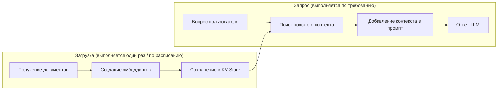

# Генерация с дополнением извлечением (RAG)

Видео: [Рабочие процессы RAG](https://www.youtube.com/watch?v=FhGZV173xrk&list=PL3MmuxUbc_hLZFNgSad56pDBKK8KO0XIv)

AI Copilot решает проблему контекста для генерации потоков. Но как быть с рабочими процессами, которым нужно отвечать на вопросы на основе ваших собственных данных? Здесь на помощь приходит RAG.

> Примечание: Потоки 1 и 2 используют `{{ secret('GEMINI_API_KEY') }}`. Поток 3 использует `{{ secret('OPENAI_API_KEY') }}` и `{{ secret('TAVILY_API_KEY') }}`. Перед их запуском убедитесь, что вы выполнили [инструкции по настройке](rus-03-setup.md) для соответствующих секретов.

## Что такое RAG?

RAG (Retrieval Augmented Generation) — это метод, который извлекает соответствующую информацию из ваших источников данных, дополняет промпт ИИ этим контекстом и генерирует ответ, основанный на реальных данных. Это решает проблему галлюцинаций, гарантируя ИИ доступ к актуальной и точной информации во время запроса.

Для более глубокого погружения в концепции RAG см. [Модуль 1: Введение в RAG](../../01-agentic-rag/lessons/03-rag.md). Для векторного поиска см. [Модуль 2: Векторный поиск](../../02-vector-search/lessons/04-vector-search.md).

## Как RAG работает в Kestra

RAG состоит из двух фаз. В демонстрационных потоках ниже они запускаются друг за другом, но в реальности вы обычно настраиваете их раздельно: загрузка по расписанию, запрос по требованию.



Фаза загрузки (выполняется один раз или по расписанию при изменении данных):

1. **Извлечение документов:** загрузка документации, заметок к релизам или других источников данных.
2. **Создание эмбеддингов:** преобразование текста в векторы с использованием модели эмбеддингов.
3. **Хранение эмбеддингов:** сохранение векторов в KV Store (хранилище ключ-значение) Kestra.

> Примечание: Для простоты потоки сохраняют эмбеддинги в KV Store Kestra. Это удобно для обучения и небольших демонстраций, но не является заменой полноценной векторной базе данных. Для серьезных задач, например, при больших наборах документов, требованиях к низкой задержке извлечения или использовании в продакшене, следует использовать специализированное векторное хранилище. См. [Модуль 2: Векторный поиск](../../02-vector-search/lessons/04-vector-search.md) для детального изучения векторного поиска на практике.

Фаза запроса (выполняется каждый раз при постановке вопроса):

4. **Извлечение контекста:** поиск эмбеддингов, наиболее похожих на вопрос пользователя.
5. **Дополнение промпта:** добавление извлеченного контента в промпт для LLM.
6. **Генерация ответа:** LLM отвечает, используя реальный, обоснованный контекст.

## Пример: Функции релиза Kestra

### Шаг 1: Без RAG

Поток: [`1_chat_without_rag.yaml`](../flows/1_chat_without_rag.yaml)

Этот поток спрашивает Gemini: "Какие функции были выпущены в Kestra 1.1?"

Без RAG модель может галлюцинировать функции, которых не существует, предоставлять устаревшую информацию или давать расплывчатые общие ответы.

Импортируйте и запустите этот поток, затем проверьте результат — ответ не будет точным.

### Шаг 2: С использованием RAG

Поток: [`2_chat_with_rag.yaml`](../flows/2_chat_with_rag.yaml)

Этот поток:

1. Загружает пост о релизе Kestra 1.1 из блога на GitHub
2. Создает эмбеддинги с помощью модели эмбеддингов Gemini
3. Сохраняет эмбеддинги в KV Store Kestra
4. Задает LLM тот же вопрос с включенным RAG
5. Возвращает точный ответ с реальными функциями из этого релиза

Импортируйте и запустите `2_chat_with_rag.yaml` и сравните качество ответа с предыдущим потоком.

## Расширение RAG веб-поиском

Примеры выше используют статический RAG — документы загружаются один раз и хранятся в KV Store. Kestra также поддерживает веб-поиск в качестве ретривера (извлекателя), который получает результаты в реальном времени при запросе и передает их как контекст в LLM.

Поток: [`3_rag_with_websearch.yaml`](../flows/3_rag_with_websearch.yaml)

> Примечание: Этот поток использует OpenAI в качестве провайдера ИИ. Для его запуска вам понадобится API-ключ OpenAI:
>
> 1. Посетите [platform.openai.com](https://platform.openai.com/home), войдите или создайте аккаунт
> 2. Перейдите в раздел **API keys** и создайте новый ключ
> 3. Экспортируйте его как секрет перед запуском Kestra:
>    ```bash
>    export SECRET_OPENAI_API_KEY=$(echo -n "ваш-openai-api-ключ" | base64)
>    docker compose up -d
>    ```
> 4. Ссылайтесь на него в потоках с помощью `{{ secret('OPENAI_API_KEY') }}`
>
> Если вы предпочитаете продолжать использовать Gemini, замените блок `provider` на `io.kestra.plugin.ai.provider.GoogleGemini` с вашим API-ключом Gemini. См. [полный список поддерживаемых провайдеров](https://kestra.io/plugins/plugin-ai/provider).

Ретривер `TavilyWebSearch` опрашивает [Tavily](https://www.tavily.com/) и внедряет результаты как контекст перед тем, как LLM сгенерирует ответ — этап загрузки (ingestion) не требуется. Однако результаты хороши лишь настолько, насколько хороша поисковая система, и могут быть неактуальными или неточными. Всегда тестируйте качество извлеченного контекста при использовании RAG с веб-поиском.

### Статический RAG vs. RAG с веб-поиском

| | Статический RAG | RAG с веб-поиском |
|---|---|---|
| Источник данных | Загруженные вами документы | Результаты из сети в реальном времени |
| Лучше всего для | Внутренних доков, политик, фиксированных баз знаний | Информации, чувствительной ко времени или часто меняющейся |
| Этап загрузки | Требуется | Не требуется |
| Пример вопроса | "Что говорится в нашей политике возврата?" | "Каков последний релиз Kestra?" |

Используйте статический RAG, когда вы контролируете исходный материал. Используйте RAG с веб-поиском, когда ответ зависит от информации, которая меняется быстрее, чем вы успеваете её перегружать.

## Лучшие практики

1. **Обновляйте документы:** регулярно проводите повторную загрузку, чтобы KV Store отражал актуальную информацию.
2. **Правильно разбивайте на части (chunking):** разделяйте большие документы на осмысленные фрагменты перед загрузкой.
3. **Тестируйте качество извлечения:** проверяйте, что для ваших запросов извлекаются правильные документы.
4. **Выбирайте правильный ретривер:** статический RAG для контролируемых баз знаний, веб-поиск для данных в реальном времени.

[← AI Copilot](rus-04-ai-copilot.md) | [ИИ-агенты →](rus-06-agents.md)
